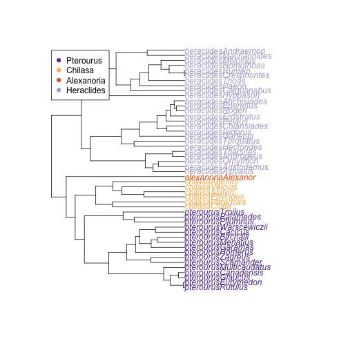

<style>
.reveal h1, .reveal h2, .reveal h3 {
  word-wrap: normal;
  -webkit-hyphens: none;
  -moz-hyphens: none;
  hyphens: none;
}

.section .reveal .state-background{
  background-color: GoldenRod;
}

</style>

Butterfly Wing Shape Evolution
========================================================
date: 24 April, 2021
author: Hannah L. Owens
autosize: true
width: 1600
height: 1200
font-family: 'Futura'

</img>

The Plan
========================================================
type: section  
- Introduction to the study
- The figure
- Plotting in phylomorphospace

The Plan
========================================================
type: section  
- **Introduction to the Study**
- The figure
- Plotting in phylomorphospace

Introduction to the Study
========================================================
incremental: false
- What is known about butterfly wing shape?
  + Wings are needed for flight
  + BUT the forewing is most important
  + Sexual selection or predation pressure may shape hindwings instead

***
</img>

Introduction to the Study
========================================================
incremental: false
- What is known about butterfly wing shape?
- New World Swallowtail Butterflies
  + Actually Americas + SE Asia
  + 66 recognized species
  + Some sexually dimorphic
  + Some mimics
  + Collected and landmarked 1449 of 60 species

***
</img>

Introduction to the Study
========================================================
incremental: false
- What is known about butterfly wing shape?
- New World Swallowtail Butterflies
- HYPOTHESIS
  + Forewing and hindwing shape are evolving independently

***
</img>

The Plan
========================================================
type: section

- Introduction to the study
- **The figure**
- Plotting in phylomorphospace

The Figure: The whole study in one place!
========================================================
type: section

</img>

The Plan
========================================================
type: section

- Introduction to the Study
- The figure
- **Plotting in Phylomorphospace**


Plotting in Phylomorphospace: Preparation
========================================================
left: 30%
- Read in TPS file of forewing landmarks
- Do Procrustes alignment of all specimens
- Remove outliers and re-align
- Calculate mean shape of each species
- Remove outliers again
- `plotTangentSpace()` gets us part way there

***


```

PC Summary

Importance of first k=16 (out of 20) components:
                           PC1     PC2     PC3     PC4      PC5      PC6
Standard deviation     0.03734 0.02138 0.02056 0.01246 0.008724 0.005915
Proportion of Variance 0.53386 0.17499 0.16189 0.05946 0.029140 0.013400
Cumulative Proportion  0.53386 0.70885 0.87074 0.93020 0.959340 0.972730
                            PC7      PC8      PC9     PC10     PC11     PC12
Standard deviation     0.005295 0.004107 0.002894 0.002604 0.001756 0.001638
Proportion of Variance 0.010730 0.006460 0.003210 0.002600 0.001180 0.001030
Cumulative Proportion  0.983460 0.989920 0.993130 0.995720 0.996900 0.997930
                           PC13     PC14     PC15      PC16
Standard deviation     0.001443 0.001214 0.001063 0.0008485
Proportion of Variance 0.000800 0.000560 0.000430 0.0002800
Cumulative Proportion  0.998730 0.999290 0.999720 1.0000000
```

Plotting in Phylomorphospace: The Main Function
========================================================
- `plotGMPhyloMorphoSpace()`
  + Does a PCA on the multivariate dataset
  + `fastAnc`-equivalent ancestral state reconstruction
- _Caveat_: `plotGMPhyloMorphoSpace()` has been deprecated since then
  + Now `gm.prcomp()` followed by `plot.gm.prcomp()`
  
***
</img>

Plotting in Phylomorphospace: First pass
========================================================

The raw output is kind of a hot mess.


```r
plotGMPhyloMorphoSpace(phy = meanFphy, A = meanF$coords)
```


Plotting in Phylomorphospace: Getting Rid of Noise
========================================================

A little better


```r
plotGMPhyloMorphoSpace(phy = meanFphy, A = meanF$coords,
                       tip.labels = F, node.labels = F) 
```


But how do we show whether or not clades are clustered?

Plotting in Phylomorphospace: Coloring By Subgenera
========================================================

- 4 subgenera
- Colors chosen to be colorblind-friendly
  + `RColorBrewer::brewer.pal` is your friend!!
- Color pairings emphasize biogeographic affinity
- First, let's get it right on a simple phylogeny


```r
col.gp <- c( "#5f3d98", "#fcb864", "#e56225", "#b2abd2") # Colors

plot(meanFphy, tip.color=c(rep(col.gp[1], times = 16), 
                      rep(col.gp[2], times = 6), 
                      rep(col.gp[3], times = 1),
                      rep(col.gp[4], times = 25)))
legend(0, 48, legend= c("Pterourus", "Chilasa", "Alexanoria", "Heraclides"), pch=19,
       col=col.gp, bty = "o")
```



Plotting in Phylomorphospace: Tips Colored by Subgenus
========================================================

- `plotGMPhyloMorphospace()` will take  additional plotting parameters!
  + in the new `plot.gm.prcomp()`, this argument is named `phylo.par`


```r
col.gp <- c( "#5f3d98", "#fcb864", "#e56225", "#b2abd2") # Colors

plotGMPhyloMorphoSpace(phy = meanFphy, A = meanF$coords, 
                       tip.labels = F, node.labels = F, 
                       plot.param = list(t.bg=c(rep(col.gp[1], times = 16), 
                                                rep(col.gp[2], times = 6), 
                                                rep(col.gp[3], times = 1),
                                                rep(col.gp[4], times = 25))))
```


Plotting in Phylomorphospace: Nodes Colored by Subgenus
========================================================

- Interior nodes come first
  + Repeat interior color (number of clades - 1) times
- Nodes within clades
  + Repeat color (number of taxa - 1) times


```r
col.gp <- c( "#5f3d98", "#fcb864", "#e56225", "#b2abd2") # Colors

plotGMPhyloMorphoSpace(phy = meanFphy, A = meanF$coords, 
                       tip.labels = F, node.labels = F, 
                       plot.param = list(t.bg=c(rep(col.gp[1], times = 16), 
                                                rep(col.gp[2], times = 6), 
                                                rep(col.gp[3], times = 1),
                                                rep(col.gp[4], times = 25)),
                                         n.cex = 1, n.bg = c(rep("black", 3),
                                                        rep(unique(col.gp)[1], 15),
                                                        rep(unique(col.gp)[2], 5),
                                                        rep(unique(col.gp)[4], 24))))
```


Plotting in Phylomorphospace: Finally, a Legend
========================================================

- First two arguments are x and y coordinates on plot
  + Just experiment until it looks good
  + Or fix it in Illustrator later!


Plotting in Phylomorphospace: Ta-da!
========================================================


Finishing
========================================================
type: section

</img>

Questions?
========================================================
type: section

Twitter handle: @HannahOish

Image credit: Dave Taft via New York Times

***

</img>


